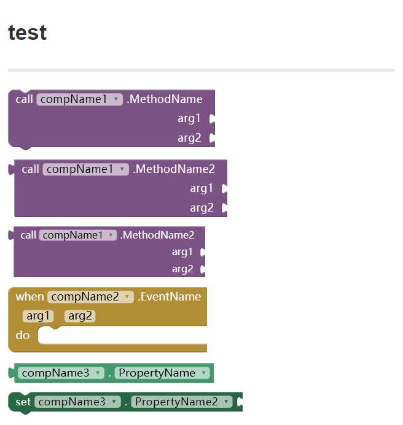

# gitbook-plugin-ai2-blocks

A plugin for gitbook, allowing create blocks through blockly with a piece of text.

It is actually creating workspace for each block, and then resize the workspace so that it just fits size the block.

## Plugin Config

* **text_call** text `call` for methods
* **text_do**   text `do` for events
* **text_set**  text `set` for properties
* **text_when** text `when` for events
* **scale_level** scale level for all blocks

e.g.

```
{
    "author": "Colintree <502470184@qq.com>",
    "plugins": [
        "ai2-blocks"
    ],
    "pluginsConfig": {
        "ai2-blocks": {
            "text_call": "call",
            "text_do": "do",
            "text_set": "set",
            "text_when": "when",
            "scale_level": 0.9,
            "margin": 0,
            "margin_left": 0,
            "margin_top": 0,
            "margin_right": 0,
            "margin_bottom": 0
        }
    }
}
```

## How to use / Example

```markdown
# test
---

{"name":"MethodName", "componentName":"compName1", "param":["param1","param2"]}

{"name":"MethodName2", "param":["param1","param2"], "output":true, "margin_left":8}

{"name":"MethodName2", "param":["param1","param2"], "output":true}

{"name":"MethodName2", "param":["param1","param2"], "output":true, "scale":0.9}

{"name":"EventName", "componentName":"compName2", "param":["param1","param2"]}

{"name":"PropertyName", "componentName":"compName3", "getter":true}

{"name":"PropertyName2", "getter":false}
```

will be converted into: (after web page loaded)


